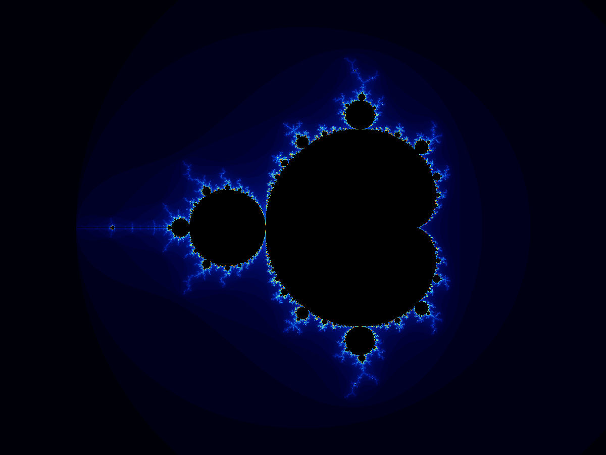

# fractal-forge

I wanted to render fractals. Then I thought it'd be cool if each commit generated a different one based on how the build actually went — cache hits, build time, actions compiled, which language you touched. So now every build leaves a visual fingerprint.



The faster and more cached your build, the deeper the zoom. Cold builds show the wide view. Failed builds always land on the seahorse valley edge. Touch a C++ file and the center shifts to a different boundary point than if you touched a Rust or Python file.

```
cpp/renderer/   C++ does the actual math
rust/cli/       Rust orchestrates and benchmarks
python/tools/   Python parses build events and git metrics, maps them to fractal params
```

## try it

```bash
# build everything
bazel build //...

# render a frame
bazel run //cpp/renderer:render_cli > out.ppm && open out.ppm

# benchmark
bazel run //rust/cli:fractal_cli -- bench --runs 5

# generate a build fingerprint from your last build
bazel build //... --build_event_json_file=build_events.json
python3 python/tools/bep_to_fractal.py \
  --bep build_events.json \
  --out fingerprint.ppm \
  --render-cli bazel-bin/cpp/renderer/render_cli
open fingerprint.ppm
```

## how the fingerprint works

| metric | fractal parameter |
|---|---|
| wall time | zoom level |
| cache hit rate | which boundary point to zoom into |
| actions compiled | iteration depth |
| build success/failure | stable center vs chaotic edge |
| dominant language touched | center region (cpp/rust/python each map to different boundary points) |
| lines added vs deleted | zoom boost or reduction |
| late night commit | higher iteration depth |
| days since last commit | subtle center drift |

## build architecture

```
//cpp/renderer:renderer      cc_library
//cpp/renderer:render_cli    cc_binary
//rust/cli:fractal_cli       rust_binary (runtime dep on render_cli)
//python/tools:bep_to_fractal  py_binary
```

needs [Bazelisk](https://github.com/bazelbuild/bazelisk), Bazel version pinned in `.bazelversion`

CI runs on every push, generates a fingerprint, and commits it to `fingerprints/`.