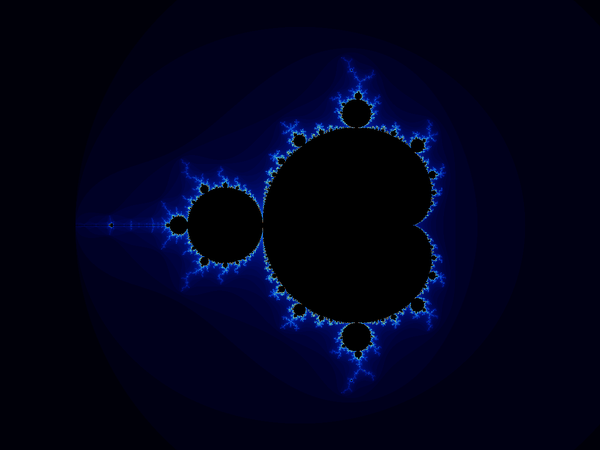

# fractal-forge

I wanted to render fractals. Then I thought it'd be cool if each commit generated a different one based on how the build actually went: cache hits, build time, actions compiled, which language you touched. So now every build leaves a visual fingerprint that evolves over time.



*each frame is a commit. the fractal mutates based on build + git metrics.*

```
cpp/renderer/   C++ does the actual math
rust/cli/       Rust orchestrates and benchmarks
python/tools/   Python parses build events and git metrics, maps them to fractal params
```

## how it works

each commit mutates the previous fractal state:

| metric | effect |
|---|---|
| lines added | zooms in |
| lines deleted | zooms out |
| cache hit rate | raises zoom floor, shifts palette |
| dominant language touched | pulls center toward that language's boundary region |
| build failure | snaps center to chaotic edge, red palette |
| late night commit | cycles palette, boosts iteration depth |
| days since last commit | subtle deterministic drift |

## try it

```bash
bazel build //...
bazel run //cpp/renderer:render_cli > out.ppm && open out.ppm
bazel run //rust/cli:fractal_cli -- bench --runs 5

bazel build //... --build_event_json_file=build_events.json
python3 python/tools/evolve_fractal.py \
  --bep build_events.json \
  --state fingerprints/state.json \
  --out fingerprint.ppm \
  --render-cli bazel-bin/cpp/renderer/render_cli
open fingerprint.ppm
```

## build architecture

```
//cpp/renderer:renderer      cc_library
//cpp/renderer:render_cli    cc_binary
//rust/cli:fractal_cli       rust_binary (runtime dep on render_cli)
//python/tools:evolve_fractal  py_binary
```

needs [Bazelisk](https://github.com/bazelbuild/bazelisk), Bazel version pinned in `.bazelversion`

CI runs on every push, evolves the fractal state, and updates the GIF.